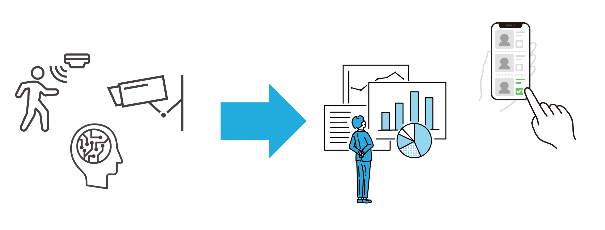

[Japanese](./README.md)

# Smart Building Quick Start Kit 

This repository summarizes the knowledge necessary to facilitate a smart building project.

`Smart building` means the state that IoT devices such as sensors and cameras are installed in a building so that the entire building can be sensed and users and developers can utilize those data easily.

 
 

**Check the following samples if you'd like to build a sample system right away:** 
- Samples
    - [Sample scripts and procedures for devices](./devices)
    - [Vantiq application](./vantiq)

**Continue to read this page if you'd like to understand the overview first.** 

 

## Steps to data utilization

## Elements responsible for each step

## Layers responsible for each step

### Important points of device layer

- Device selection
    - Features/Functions
    - Accuracy/Precision
    - Installation requirements
> You need to select devices carefully. If the quality of device is poor, the quality of data finally provided to users through upper layers will also be poor, so when selecting devices, check each of the above items in detail.

- Data specification
    - Format
    - Protocol
    - Transmission frequency
- How to send data to "data integration layer"(Vantiq)
    - From sensors directly, via an IoT gateway, via a broker, via a device-specific service or etc.
    - When sending directly to Vantiq via REST API, it's necessary to check how to set HTTP Header, method, and body (Some devices cannot set them).
    - Send data via a broker/brokers so that the device layer and data integration layer are loosely coupled.

 

### Important points of data integration layer
- Who and how manages master data
    - Who manages and maintains the master data needed to process data sent from devices.
        - e.g.: Master data management system holds master data such as id, installation position, and update Vantiq Type for master data via REST API. In other words, the master data is additional information needed to implement arbitrary processes  (identifying a device or installation area and so on).

- Data creation/delivery according to requirements
    - Create the necessary data according to the requirements by integrating data sent from the device layer.
        - e.g.: 
            - Transformed data for users to utilize easily
            - Data delivered in real-time (like meaning that an emergency has been detected)
            - Log data
    - Deliver those data to the recipients who need them.
- Storage location selection according to the characteristics of data
    - Save the data in the required format at the required location.
        - e.g.: 
            - Save time series data in the data store.
            - Hold latest sensing results in a stream processing engine.
        - It depends on the characteristics of the data.
- Performance-considered implementation
    - Won't get the high performance just by using Vantiq. Proper implementation is required.
    - Implement in consideration of the number of devices and the frequency of data transmission.
        - e.g.: 
            - Use MQTT instead of REST.
            - Minimize read/write frequency to Type by denormalizing.
    - Too much priority to performance causes to loss of readability and maintainability of Vantiq applications, so you need to balance it.

### Important points of data providing layer
- Prepare API and broker according to characteristics of data.
    - Via API: data that users get when they need it（PULL type）
        - e.g.: Congestion information in the building
    - Via Broker: data delivered in real-time (PUSH type)
        - e.g.: Alerts like intrusion detection
- Broker selection and setting
    - Performance and the number of simultaneous connections depend on the type and settings of brokers, so it's necessary to make appropriate selections and settings.

 

## [Sample] PULL type data providing

 

## [Sample] PUSH type data providing

 
 

## Next step
- A more detailed explanation of smart building
    - [Smart Building Quick Start Details](./docs/en/details.md)
- Samples
    - [Sample scripts and procedures for devices](./devices)
    - [Vantiq application](./vantiq)

> Samples of devices (device layer) and Vantiq application (data integration layer) are included in this package.