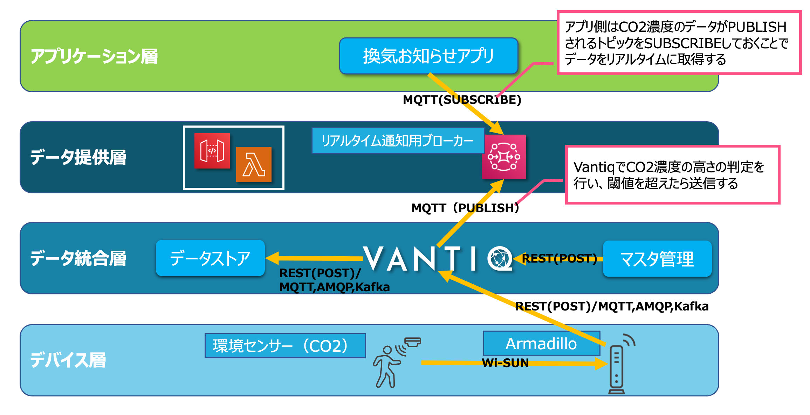

[English](./README.en.md)

# Smart Building Quick Start Kit 

スマートビル化を行うプロジェクトを推進するために必要な知識、考え方、注意点をまとめています。
また、実際にシステム構築ができるようサンプルを用意しています。

`スマートビル化`とはセンサーやカメラなどのデバイスをビルに設置し、ビル全体をセンシングできるようにした上でそれらの情報を開発者が用意に活用できる状態を指しています。

 
 

**早速サンプルシステムを構築したい方はこちら→** [Sample Smart Building](./sample)

**まずは概要を抑えたい方はこのまま読み進めてください↓** 

 

## データ活用までのステップ

## スマートビル部分の各ステップを担う要素

## 各ステップを担うレイヤー

### デバイス層で考慮すべき事項

- デバイス選定
    - 何ができるのか
    - 精度
    - 上記を満たすための設置要件
>デバイスの質が悪ければ上位レイヤーを経て最終的にユーザーに提供されるデータの質も下がり、システムの質を左右することになるのでデバイス選定は慎重に行う必要がある

- データの特徴
    - データフォーマット
    - プロトコル
    - 送信頻度
- データ統合層（Vantiq）へのデータ送信方法
    - センサーから直接送信、IoTゲートウェイ経由、ブローカー経由、そのデバイス専用サービス経由などが考えられる
    - VantiqにRESTで直接送信する場合アクセストークンが必要なためHTTPヘッダーの設定ができるかなど考慮する必要がある
    - デバイス層とデータ統合層を疎結合にするために可能であればブローカーを経由させる

 

### データ統合層で考慮すべき事項
- マスタデータの管理・更新
    - デバイスから送信されたデータを処理する際に必要なマスタデータを誰が管理し、どのように更新するか
        - 例: 別システムでデバイスに関するマスタデータ（ID、設置場所など）を管理し、Vantiq REST API経由でマスタデータ用のTypeのレコードを更新する
- データ作成・送信
    - 要件に応じて必要なデータ（最終的に提供するフォーマットに整形したデータ、閾値判定したリアルタイム性の高いデータ、ログデータなど）を作成し、必要な送信先に送信する
- データの保存
    - 時系列データはデータストア、最新のセンシング結果はストリーム処理エンジンにそのまま保持など、データの特性に合わせて必要な箇所に必要な形式でデータを保存する
- パフォーマンス
    - 使用するデバイス数とそのデータ送信頻度などを考慮した実装を行う
        - 例: デバイス数が多い場合→RESTではなくより軽量なMQTTを使う、Typeへの読み書きの頻度を最小限にするなど

### データ提供層で考慮すべき事項
- データの性質に合わせてAPIとブローカーをそれぞれ用意する
    - API経由: 必要なタイミングで取得すれば良いデータ（PULL型）
        - 例: ビル内の混雑状況
    - ブローカー経由: リアルタイム性が求められるデータ（PUSH型）
        - 例: 侵入検知のようなアラート
- ブローカーの選定・設定
    - ブローカーの種類や設定によってパフォーマンスやハンドリングできる同時接続数が異なるため、適した選定と設定を行う必要がある

 

## PULL型のデータ提供例

 

## PUSH型のデータ提供例

 
 

## 次のステップ
- スマートビル化についてのより詳細な説明
    - [Smart Building Quick Start Details](./docs/ja/details.md)
- サンプル
> 本パッケージにはデバイス層からデータ統合層（Vantiqアプリケーション）のサンプルが含まれています。

    - [接続デバイスのサンプルスクリプト及び手順](./devices)
    - [Vantiqアプリケーション](./vantiq)