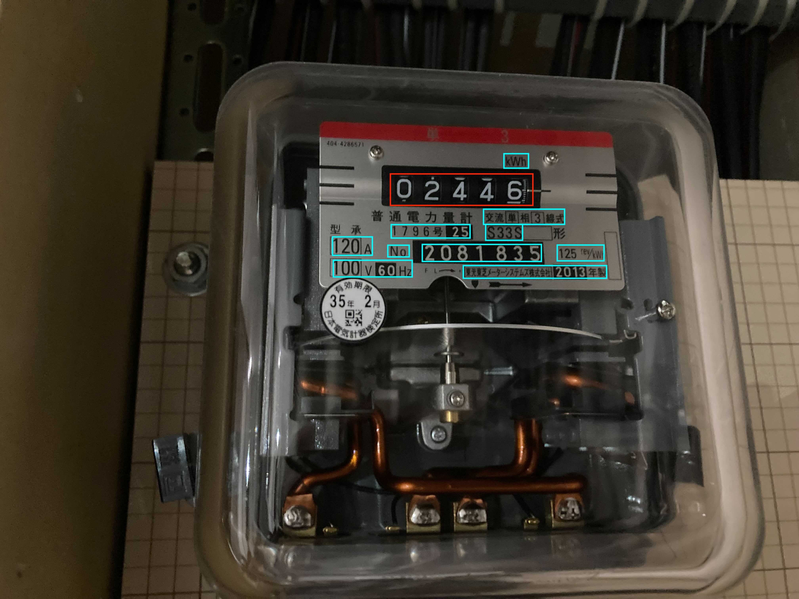

[English](./README.en.md)

# ドラム式メーターリーダー

ドラム式メーターの値を読み取り、MQTT broker に読み取った値を送信する手順です。

## 仕様

### ドラム式メーターの読み取り

ドラム式メーターの読み取りは [PaddleOCR](https://github.com/PaddlePaddle/PaddleOCR) を用いて実現しています。
利用方法は [PaddleOCR Quick Start](https://github.com/PaddlePaddle/PaddleOCR/blob/release/2.3/doc/doc_en/quickstart_en.md#22-use-by-code) を参考にしています。

ドラム式メーターを読み取り、複数値を検出した場合、検出した矩形(Bounding Box)の面積を計算し、一番面積が大きい値を送信します。  
同梱しているサンプル画像を例にすると、赤い枠の値`02446` を送信します。



PaddleOCR がどのように画像中の文字列を検出しているかは、以下デモページにて確認することができます。適宜ご利用ください。

[https://huggingface.co/spaces/akhaliq/PaddleOCR](https://huggingface.co/spaces/akhaliq/PaddleOCR)

## セットアップ

### 必要なもの

- 検出対象にするドラム式メーター
> 本手順で使用するスクリプトは、サンプル画像でも動作させることができます。サンプル画像を使う処理はコメントアウトされておりますので、必要な場合は該当箇所のコメントを解除してください。

- カメラ付きPC ※ 本手順の検証では MacBook Pro(2018)を使用しています

>PaddlePaddleモジュールは現在Arm64に対応していないため (2021/10/18時点)、Apple M1が搭載されているMacでは動作しません。

- 本ディレクトリ一式

### 手順

1. OpenCV インストール
   MacOS では、以下のコマンドでインストールします

```sh
$ brew install opencv
```

2. drum_meter_reader.py と同じディレクトリに`requirements.txt` ファイルを設置し、サンプルスクリプトに必要な Python モジュールをインストールします

```
$ pip3 install -r requirements.txt
```
> Python 3.9.x系の場合、PaddleOCRのインストールが失敗することがあります。その場合は3.8.x系に切り替えてください。

3. 秘匿情報等は環境変数としてスクリプトへ読み込みます  
   `.env.sample` ファイルをコピーして `.env` ファイルを作成し、ファイル内の説明に沿った値を設定してください

## ドラム式メーターの数値検出

`drum_meter_reader.py`を実行してドラム式メーターの値を読み取り、MQTT broker にデータを送信します。

```sh
$ python3 drum_meter_reader.py
```

## 送信詳細

| 項目         | 内容                  |
| ------------ | --------------------- |
| プロトコル   | MQTTS                 |
| 頻度         | 30 秒ごとに 1 回送信  |
| フォーマット | JSON                  |

```JSON
{
  "sensorId": "string",
  "sensing_value": "string",
  "timestamp": int
}
```

## 注意点

- サンプル画像を基に調整して数値を検出しています。自身で撮影した画像を利用する場合、正しく数値を検出できない場合があります。下記注意点を参考にご用意ください。
  - メーター部分のみを大きく、明るく撮影してください。
  - メーター部分に光の反射が写り込まないように撮影してください。
  - メーター部分が真正面になるよう撮影してください。
  - メーター部分が黒背景に白文字であることを想定に調整しています。
  - 数字が回転途中である場合、正しく読み取りできません。
- MQTT broker との通信経路の暗号化・認証は簡易的なものなので、実際の案件で求められるセキュリティレベルに応じて対策ください。
