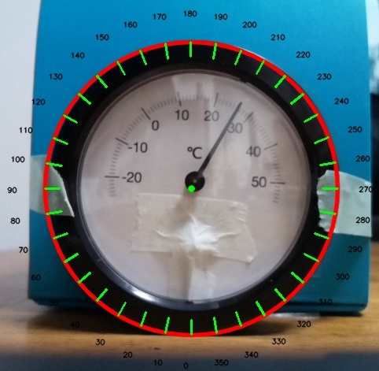

[Japanese](./README.md)

# Round meter reader

## Overview and Prerequisite

This is the procedure for reading the value of a round-shaped meter and sending it to an MQTT broker.

For high accuracy in reading values, it is necessary for the camera to capture so that the meter part occupies most of the camera's field of view. It's also important that the meter part is not shaded.

It is not suitable for high accuracy requirements, as this was created for the purpose of experiencing the process of Smart Building.

## Required items
- Round meter
    - No multiple types of measurements. (Not a temperature-humidity meter, etc.)　
    - [Reference image](#meter-image)
> The sample script's target is not limited to a temperature meter. However, in this Smart Building Quick Start Kit, it is used as reading a temperature meter.

- Python script
    - analog_round_meter_reader.py

> The sample script also works with the sample image. You can try it without Raspberry pi or a round meter. The source code for using the sample image has been commented out, so please uncomment it if necessary.

- PC with a camera   
    - This procedure has been verified with Raspberry pi 4B + Picamera v2.
- MQTT Broker


## Procedure

1. Set the environment variables used in the script.

Create a `.env` file in the same directory as the script and set the information about your MQTT Broker and about round meter's scales such as min/max value, min/max value angles.

```.env
# Mqtt broker
MQTT_HOST = 'your-broker.com'
MQTT_PORT = 8883
MQTT_TOPIC = '/analog_meter/temperature'
MQTT_USER = "your-username"
MQTT_PASSWORD = 'your-password'

# Analog round meter
MIN_ANGLE = 80
MAX_ANGLE = 280
MIN_VALUE = -30
MAX_VALUE = 60
```
>**How to set up the Round meter information**

<a id="meter-image"></a>

【Reference image】



For the reference image, the configuration information is the followings.  

```
MIN_ANGLE = 80  # Minimum value angle
MAX_ANGLE = 278 # Maximum value angle
MIN_VALUE = -25 # Minimum value of scales
MAX_VALUE = 55  # Maximum value of scales
```
> While executing the script, the angles are displayed around the meter. You can check min/max value angles by executing the script with arbitrary values first.


2.  Run `analog_round_meter_reader.py`
> Before executing the script, check the script and install missing modules that are not installed in your environment yet.
```
$ python analog_round_meter_reader.py
```


**Output specifications**

|Items|Details|
|---|---|
|Protocol|MQTTS|
|Frequency|Transmit once every 60 seconds|
|Format|JSON |

```JSON
{
   "deviceId": "temp_meter_001",  # Device ID
   "temperature": 27.48 # Temperature (℃)
}
```
