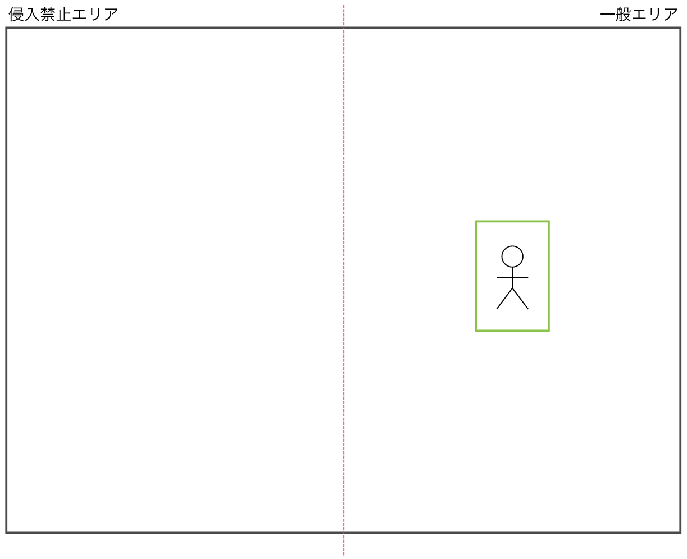
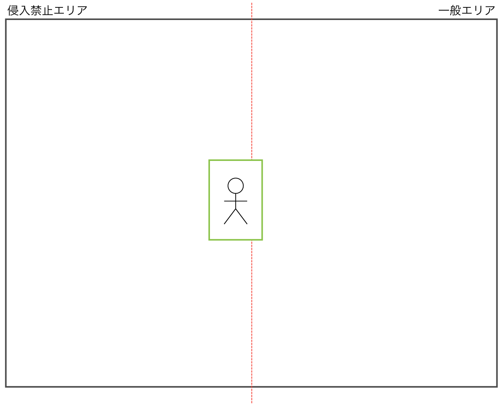
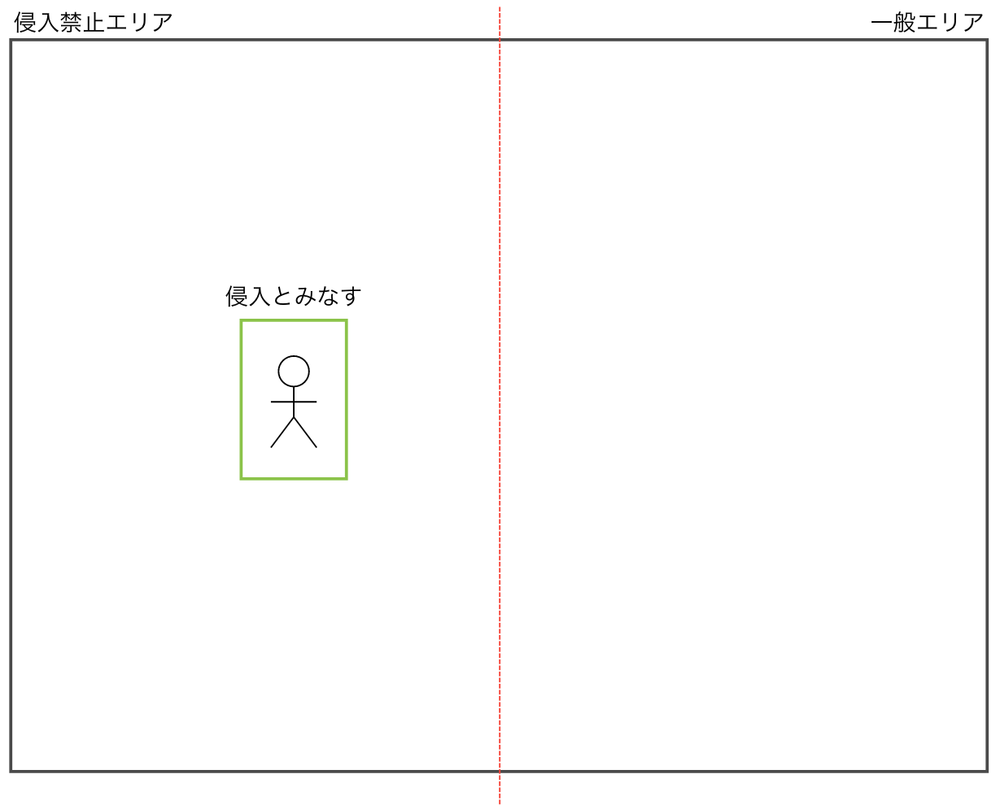

[Japanese](./README.md)

# Intrusion Detection

This is the instructions to analyze video images acquired by a camera with TensorFlow Lite, and when detecting intrusion into an area, send data to an MQTT Broker.  

## Specifications

### Detect a person

Take a picture with the camera connected to the Rasbperry Pi and detect a person. It is developed based on the following sample programs of TensorFlow Lite.

[TensorFlow Lite Python object detection example with Raspberry Pi](https://github.com/tensorflow/examples/tree/master/lite/examples/object_detection/raspberry_pi)

The models in the above sample programs can detect a variety of objects other than persons. In these instructions, customized to detect intrusion only when a person is detected.

### Detect intrusion into a specified area.  

Put a virtual line in the middle of the screen, and regard the left side of the screen (width: 320px) as the restricted area.  



Detect when a person overlaps the virtual line (Figure 1), and then when the person has completely moved into the restricted area (Figure 2), publish the event of detection to the MQTT broker.

Figure 1.  


Figure 2.  


It is confirmed that it can detect when a person walks sideways at a distance of about 1.5 m to 2.0 m from the camera. It may fail to detect when a person is walking too fast due to the high CPU load.

## Setup

### Requirements for these instructions.

- Raspberry Pi  &nbsp; ※ Use Raspberry Pi 3B for verification.  
- [Raspberry Pi Camera Module 2](https://www.raspberrypi.com/products/camera-module-v2/)
- [Raspberry Pi OS with desktop (32bit)](https://www.raspberrypi.org/software/operating-systems/#raspberry-pi-os-32-bit)
- Full set of this directory

### Instructions

1. Setting up both Raspberry Pi and Raspberry Pi Camera.   
   Connect the Raspberry pi and the Raspberry Pi Camera, and start them up.  

2. Install "TensorFlow Lite runtime".  
```
$ pip3 install --extra-index-url https://google-coral.github.io/py-repo/ tflite_runtime
```

3. Install the required Python modules and TensorFlow lite model and labels.    
   Place the `requirements.txt` file in the same directory as the `download.sh`, and run the following command.  

```
$ bash download.sh ./tmp
```

4. Load confidential information into the script as environment variables.    
   Copy the `.env.sample` file to create a `.env` file and set the values according to the instructions in the file.  

## Detect intrusion into the specified area.  

Run `intrusion_detect.py` and as soon as a person walks in front of the Raspberry Pi Camera, it will send the data to the MQTT broker.  

```
python3 intrusion_detect.py \
  --model ./tmp/detect.tflite \
  --labels ./tmp/coco_labels.txt
```

## Transmission details

| Items         | Details                                                 |
| ------------ | ---------------------------------------------------- |
| Protocol   | MQTTS                                                |
| Frequency    | Event-driven (Transmit when a person crosses the virtual line.)|
| Format | JSON                                                 |

```JSON
{
  "camera_id": "string",
  "timestamp": int,
  "count": int
}
```

## Notes  

- Only one person should be caught by the Raspberry Pi's camera.  
- Set up the camera around the same height as a person.  
- A person must walk sideways to the camera.  
- It may fail to detect when walking speed is too fast.  
- This confirmed with a Raspberry Pi 3B, but the usage of some of the CPU cores will be 100%, so prepare a Raspberry Pi with higher specifications depending on the use case.  
- Since the encryption and authentication of the communication path with the MQTT Broker is a brief one, please take measures according to the security level required in the actual project.  
