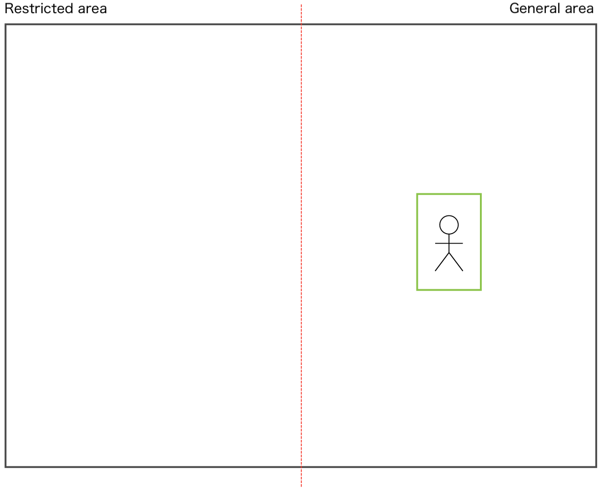
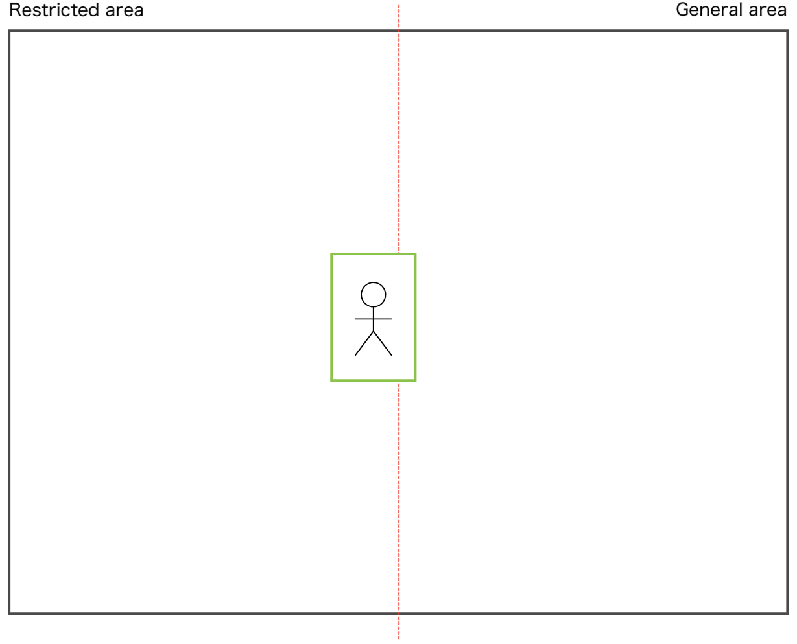

[Japanese](./README.md)

# Intrusion detection

This is the procedure to detect an intrusion into the area by analyzing video with TensorFlow Lite, and sending it to an MQTT Broker.

## Specifications

### Detect person

Capture video with the camera connected with Raspberry Pi and detect a person. The sample script is developed based on the following sample program of TensorFlow Lite:

[TensorFlow Lite Python object detection example with Raspberry Pi](https://github.com/tensorflow/examples/tree/master/lite/examples/object_detection/raspberry_pi)

The model of the above sample program can detect various objects other than people. In this procedure, the sample script is customized to detect only people. When detecting a person, intrusion detection process starts.

### Detect intrusion into restricted area

Put the virtual line in the middle of the camera's field of view (red dotted line), and regard the left side as the restricted area.



Detect when a person overlaps the virtual line (Figure 1), and then when the person has completely moved into the restricted area (Figure 2), send intrusion event to an MQTT broker.

Figure 1.  


Figure 2.  


The sample script has been confirmed to be able to detect when a person passes sideways 1.5m to 2.0m from the camera.
This process is High CPU load and can fail a person passes too fast.

## Setup

### Required items

- Raspberry Pi
   -  This procedure has been verified with Raspberry Pi 3B.
- [Raspberry Pi Camera Module 2](https://www.raspberrypi.com/products/camera-module-v2/)
- [Raspberry Pi OS with desktop (32bit)](https://www.raspberrypi.org/software/operating-systems/#raspberry-pi-os-32-bit)
- Full set of this directory

### Procedure

1. Set up Raspberry Pi and Raspberry Pi Camera.
   Connect Raspberry pi and Raspberry Pi Camera, and start them up.  

2. Install TensorFlow Lite runtime.  
```
$ pip3 install --extra-index-url https://google-coral.github.io/py-repo/ tflite_runtime
```

3. Install the required Python modules and TensorFlow lite models/labels.    
   Place the `requirements.txt` file in the same directory as `download.sh`, and run the following command.  

```
$ bash download.sh ./tmp
```

4. Load confidential information into the script as environment variables.    
   Copy the `.env.sample` file to create a `.env` file and set the values according to the file contents.  

## Detect intrusion into restricted area

Run `intrusion_detect.py` and a person walks in front of the Raspberry Pi Camera, it will send intrusion event to an MQTT Broker.

```
python3 intrusion_detect.py \
  --model ./tmp/detect.tflite \
  --labels ./tmp/coco_labels.txt
```

## Output specifications

| Items         | Details                                                 |
| ------------ | ---------------------------------------------------- |
| Protocol   | MQTTS                                                |
| Frequency    | Event-driven (Transmit when a person crosses the virtual line.)|
| Format | JSON                                                 |

```JSON
{
  "camera_id": "string",
  "timestamp": int,
  "count": int
}
```

## Notes  
- The sample script can detect only one person.
- Set the camera at about a person waist height.
- The encryption and authentication used in the sample script to communicate with an MQTT broker are simple. You need to modify according to your project's requirements. 