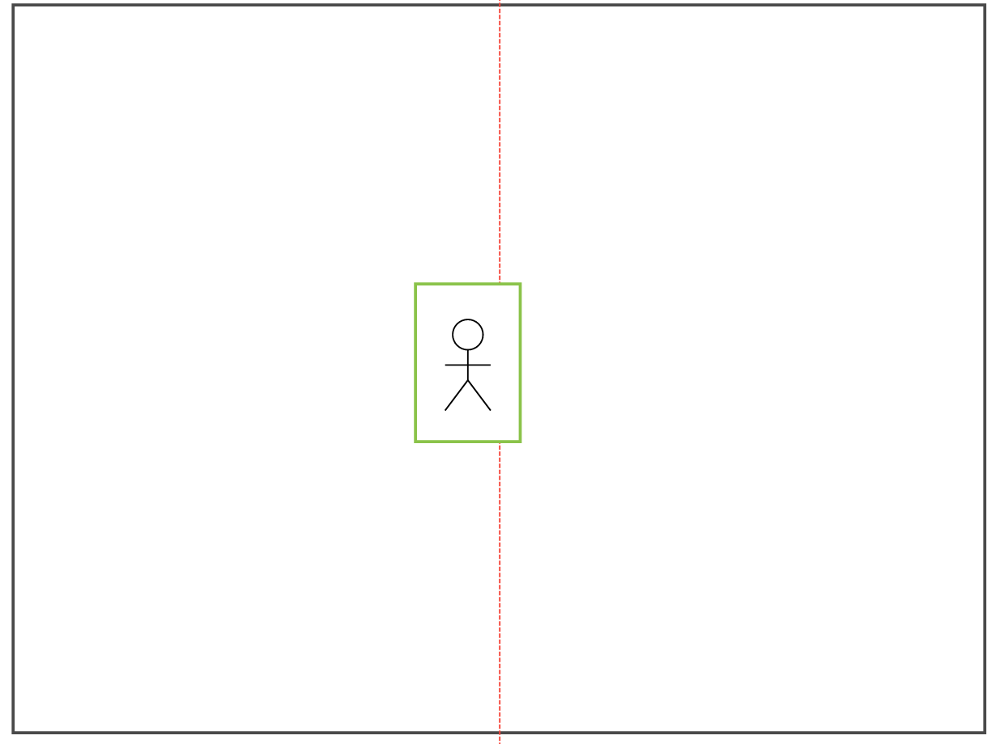

[English](./README.en.md)

# 人数カウント

カメラで取得した映像をTensorFlow Liteで解析し、エリア内への進入を検知した際とエリア外に退出した際にMQTTブローカーに送信する手順です。

## 仕様

### 人の検出

Raspberry Pi に接続されたカメラで撮影を行い、人を検出します。  
TensorFlow Lite の以下サンプルプログラムをベースに開発しました。

[TensorFlow Lite Python object detection example with Raspberry Pi](https://github.com/tensorflow/examples/tree/master/lite/examples/object_detection/raspberry_pi)

上記サンプルプログラムのモデルは人以外にも様々なオブジェクトを検知できます。  
今回は人が検出された場合のみ処理が行われるようカスタマイズしています。

### 特定エリアへの出入りを検出

カメラの視野の中央に仮想線を設け、左側をエリア内・画面右側をエリア外とみなしています。


人が仮想線に重複した時点で検知され(図 1)、仮想線の左右に移ったタイミングで(図 2 または 3)、MQTTブローカーに検出イベントを publish します。

図 1


図 2


図 3


カメラから 1.5m〜2.0m ほどの位置を人が横向きに歩いたときに、検出できることを確認しています。  
CPU の負荷が高いので、人が歩くスピードが速すぎる場合に検出に失敗する可能性があります。

## セットアップ

### 必要なもの

- Raspberry Pi ※検証では Raspberry Pi 3B を使用
- [Raspberry Pi Camera Module 2](https://www.raspberrypi.com/products/camera-module-v2/)
- [Raspberry Pi OS with desktop (32bit)](https://www.raspberrypi.org/software/operating-systems/#raspberry-pi-os-32-bit)
- 本ディレクトリ一式


### 手順

1. Raspberry Pi と Raspberry Pi Camera の設定
Raspberry piとRaspberry Pi Cameraを接続し、起動してください

2. TensorFlow Lite runtime をインストール
```
$ pip3 install --extra-index-url https://google-coral.github.io/py-repo/ tflite_runtime
```

3. 必要なPythonモジュールとTensorFlow liteのモデル・ラベルのインストール
`download.sh`と同じディレクトリに`requirements.txt` ファイルを設置し、以下のコマンドを実行します

```
$ bash download.sh ./tmp
```

4. 秘匿情報等は環境変数としてスクリプトへ読み込みます  
   `.env.sample` ファイルをコピーして `.env` ファイルを作成し、ファイル内の説明に沿った値を設定してください

## 特定エリアへの出入りを検出

`person_count.py`を実行して、Raspberry Pi Camera の前で人が歩くと方向次第でMQTTブローカーにデータを送信します。

```
python3 person_count.py \
  --model ./tmp/detect.tflite \
  --labels ./tmp/coco_labels.txt
```

## 送信詳細

| 項目         | 内容                                                 |
| ------------ | ---------------------------------------------------- |
| プロトコル   | MQTTS                                                |
| 頻度         | イベントドリブン(人が仮想線を越えたタイミングで送信) |
| フォーマット | JSON                                                 |

```JSON
{
  "camera_id": "string",
  "timestamp": int,
  "count": int
}
```

## 注意点

- Raspberry Piのカメラには1人だけが映るようにしてください。
- 人と同じ高さを目安にカメラを設置してください。
- MQTT broker との通信経路の暗号化・認証は簡易的なものなので、実際の案件で求められるセキュリティレベルに応じて対策ください。
