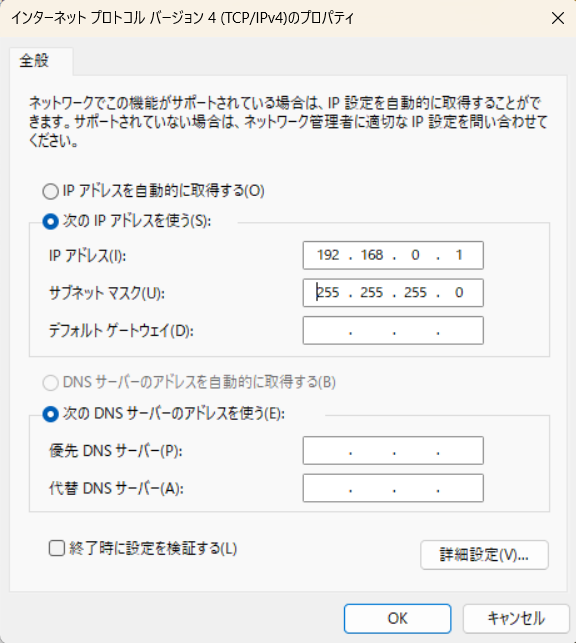
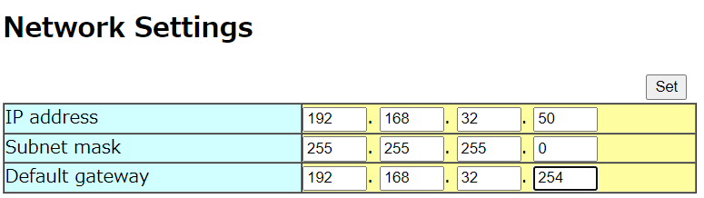

# 日立LG LiDARセンサー（HLS-LFOM5） ネットワーク初期設定

### **概要・前提**
この文書は 日立LG LiDARセンサー(LS-LFOM5) のネットワーク初期設定を行った際の手順の記録です。すべてのネットワーク環境に当てはまるものではないため、正確な内容は機器のマニュアルをご確認いただくとともに、オフィス環境での設定を行う際はネットワーク管理者にご相談ください。

### **必要なもの**
---
- 日立LG LiDARセンサー（本手順ではHLS-LFOM5を1台使用）
- Windows端末
- PoE対応ネットワークハブ

## **手順**
### 1. ネットワークハブとの接続
---
1. 日立LG LiDARセンサー(LS-LFOM5) の接続
    1.  PoE対応ネットワークハブを電源に接続し、電力が供給されていることを確認する。
    1.  日立LG LiDARセンサー(LS-LFOM5) をネットワークハブに接続する。センサーに電力が供給され、LED表示が緑点滅していることを確認する。

1. Windows端末の接続
    1. 既存の接続を切断する(WiFi接続ならWiFiをオフにする)。
    1. PoE対応ネットワークハブとWindows端末を有線で接続する。
    1. Windows端末のIPアドレスを、日立LG LiDARセンサー(LS-LFOM5) の初期IPアドレス `192.168.0.105` と通信できるよう `192.168.0.*` に設定する。
    

### 2. 日立LG LiDARセンサー(LS-LFOM5) のIPアドレス変更
---
1. Windows端末のブラウザから http://192.168.0.105/cgi-bin/network_setting を開き、日立LG LiDARセンサー(LS-LFOM5)のネットワーク設定画面を表示する。
1. 使用するネットワーク環境の値で、センサーのIPアドレス・サブネットマスク・デフォルトゲートウェイを設定する。オフィス環境で使用する場合は、ネットワーク管理者に確認の上設定すること。

### 3. ネットワーク接続の確認とファームウェアアップデート
---
1. Windows端末のネットワーク設定を、上記 1. ネットワークハブとの接続 で変更した設定から元の設定に戻し、インターネット接続が可能なことを確認する。

2. [こちら](https://solutions.hitachi-lg.biz/tof-sensor/)からセンサーのファームウェアをダウンロードする。

3. 上記サイトの手順通りに実行し、ファームウェアがアップデートされたことを確認する。
