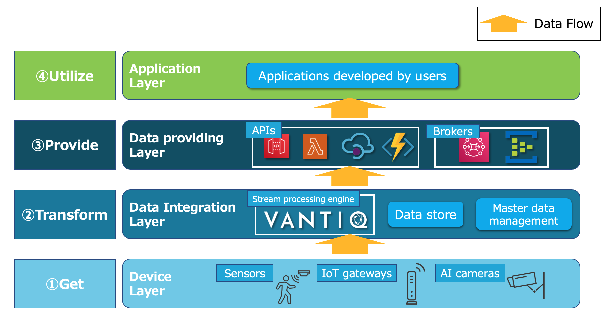

[Japanese](../ja/DETAILS.md)

# Smart Building Quick Start Details

## Contents  

1. [Introduction](#introduction)
2. [Device Layer](#device-layer)

    2.1. [Device specification](#device-spec)

    2.1.1. [What can this device do](#what-can-device-do)

    2.1.2. [Device quality](#device-quality)

    2.1.3. [How to send data](#device-data-sending)

    2.1.4. [How to supply power](#device-power-supply)

    2.1.5. [Installation requirement](#device-installation)

    2.1.6. [Data specification](#device-data-spec)

    2.2. [Price](#device-price)

    2.3. [Laws and Regulations](#device-laws)

    2.4. [Data loss](#device-data-loss)

    2.5. [Data sending path to data integration layer (Vantiq)](#device-data-path)

    2.6. [Operation in abnormality/failure](#device-operation)

    2.7. [Summary of Device Layer](#device-summary)

3. [Data Integration Layer](#data-integration-layer)

    3.1. [Master data management](#data-integration-master-data)

    3.2. [Data store](#data-integration-data-store)

    3.3. [Vantiq](#data-integration-vantiq)

    3.3.1. [Frequently used Activity Patterns](#data-integration-activity)

    3.3.2. [Performance-considered implementation](#data-integration-performance)

    3.3.2.1. [Lighten processing per task](#data-integration-lighten)

    3.3.2.2. [Reduce/divide queries](#data-integration-reduce-queries)

    3.3.2.3. [Reduce simultaneous executions](#data-integration-reduce-simultaneous)

    3.3.2.4. [Verify actual performance](#data-integration-performacne-test)

    3.4. [Summary of Data Integration Layer](#data-integration-summary)

4. [Data Providing Layer](#data-providing-layer)

    4.1. [PULL type (API) data providing](#data-providing-pull)

    4.2. [PUSH type (Broker) data providing](#data-providing-push)

    4.3. [Summary of Data Providing Layer](#data-providing-summary)

<br />
<br />

<a id="introduction"></a>
## 1. Introduction

This document summarizes the details of the knowledge, concept and important points necessary to build a smart building with Vantiq. Smart building includes a wide range of elements, from devices to clouds, and not many people have an overall picture yet.

However, what you need to think about is, after all, the simple flow of how to collect, process, and provide data. It would be appreciated if you would read this document while being conscious of how can achieve that flow.

This content is just a basic pattern, so you will need to modify some parts according to your project/requirement, but the basic idea is the same.

This document is constructed based on the each layer of the following figure:



<a id="device-layer"></a>
## 2. Device Layer

Devices are the most important element of all IoT projects, not just for smart building. Any plans can never be achieved without devices that can acquire necessary data.
In addition, **device accuracy/precision is linked directly to the entire system's data quality**. In other words, making mistakes in device selection leads directly to the failure of the project itself. So **you need to select them carefully**.

Now let's move on to the device section.


<a id="device-spec"></a>
### 2.1. Device specification

You need to confirm the device specification in detail for judging whether you can achieve what needs to achieve in your project with that device.

**You'd better do this process carefully, even if it takes time. When devices are not suitable, the project will fail and waste time and money**.

<a id="what-can-device-do"></a>
### 2.1.1. What can this device do

First of all, it's just obvious but, you need to know exactly what the device can do.

For example, even if you simply say "temperature sensor", you need to confirm &nbsp;**① what range of temperature it can measure (detection range)**, &nbsp;**② what unit it can measure (resolution)**, and &nbsp;**③ how much error may occur (accuracy)**.

You can't develop obviously the function of alerting when the temperature exceeds 100℃ if you selected a temperature sensor whose detection range is -30℃ to + 60℃.

Shouldn't think just like "this is a temperature sensor.". It's necessary to grasp in detail like "this temperature sensor can measure the detection range from -30℃ to + 60℃ in 0.1 ℃ increments and may have an error of about ± 0.2 ℃" firstly.

In addition, If you use devices that keep looking at a specific section such as AI cameras, it's important to confirm the coverage area by each device. It's strongly related to the total cost.


<a id="device-quality"></a>
### 2.1.2. Device quality

Frequent device failures, poor fire/water resistance and etc. can cause unexpected maintenance costs and accidents. 

It's very basic, but you should confirm the quality. It's safe to purchase 1 device and verify it actually before final selection, even from an aspect to verify the accuracy.

<a id="device-data-sending"></a>
### 2.1.3. How to send data

Confirm how to send the sensed data to another layer.

For example, if you'd like to use a temperature sensor, it doesn't make sense to just have a module with sensor elements, of course. Only after being used in combination with a micro-computer/IoT gateway(some devices include them), can send the data to another layer.

As for sending data way, it depends on devices:
- Used in combination with IoT gateway
- BLE connection
- Via a unique cloud service for the device
- Etc.
So, you need to confirm the way of your devices.

In the case of using IoT gateway, you also need to confirm the path of after IoT gateways like WiFi or LTE.

<a id="device-power-supply"></a>
### 2.1.4. How to supply power

Whether a battery-powered device or not affects the installation position and maintainability. For smart buildings, battery-powered devices are not unlikely to be options, but it's safer to confirm.

<a id="device-installation"></a>
### 2.1.5. Installation requirement

There are two installation requirements meanings.

**The first is the device installation requirement**. It means that under what circumstances(environment/condition) the device can perform like defined in the specification. You should confirm how to make devices perform correctly after understanding what devices can do because devices don't work well if you installed devices incorrectly. For example, even if you have an AI camera that can detect a human face with 100% accuracy, it doesn't work well when using it in a dark/too bright place where images quality will become low.  

**The second installation requirement is from the building owner**.
There are not many cases you can install your devices anywhere in the building as you like. It's necessary to install it in the position permitted by the building side in consideration of the landscape and failure/replacement.

You'd better make sure the following thing: 
"I can achieve what I want to do with this device, but can this device install in an easy-to-maintain position of this building?"


<a id="device-data-spec"></a>
### 2.1.6. Data specification

Confirm protocol, format, size, and frequency of sending. Protocol and format will determine how can send the data to another layer. Size and frequency of sending affect the performance and implementation of the opposite system.

<a id="device-price"></a>
### 2.2. Price

Calculate the total price of the number of devices, IoT gateways, WiFi routers, SIM cards, and other necessary items and confirm whether the cost is worth it. Some devices need to use a unique cloud service for that device to send data, you may need to consider the cost of that kind of service also.

<a id="device-laws"></a>
### 2.3. Laws and Regulations

You have to be careful when using devices from overseas. It may be developed based on laws and regulations from your country. Devices must comply with the laws of your country. 

In addition, you also have to be careful when handling sensitive data like including personal information.


<a id="device-data-loss"></a>
### 2.4. Data loss

Especially in the case of wireless connection, data loss will occur, so it is necessary to consider measures such as increasing the number of devices to reduce the loss rate, complementing on the application side, and designing so that not be affected by data loss. 

<a id="device-data-path"></a>
### 2.5. Data sending path to data integration layer (Vantiq)

You need to consider how to send data from devices to Vantiq in the data integration layer. There are 2 main patterns.
The first is to use Vantiq REST API. The second is via broker with protocols such as MQTT, AMQP, and Kafka. 

First, when using Vantiq REST API, Devices must set the Vantiq access token in the header when making HTTP requests. You can use this way if your devices have this function. In some cases, a device can make HTTP requests, but not be able to set the header. In this case, you can use the Vantiq REST API by relaying the data with AWS Lambda/Azure Functions. (The device just makes a request to Lambda/Functions, then Lambda/Functions that hold the Vantiq access token make a request to Vantiq.)

**Using REST API is simple/easy, but it has the following disadvantages**:

1. Manage access token are complicated

    Since access tokens are embedded in the device side, you may need to replace tokens for all devices if it has to be updated due to expiration or leak. It depends on how tokens were distributed, but it's tough.

2. Impact on Vantiq performance

    Since HTTP is not lightweight, It consumes a lot of Vantiq resources if you use a large amount devices.

Secondly, if you select the way via a broker, no need to distribute access tokens (but the broker's authentication information is required).
In addition, MQTT, AMQP, and Kafka which are lighter than HTTP can be used. The disadvantages are the followings:

1. Need to prepare broker

    For example, you need to prepare AWS AmazonMQ/Azure Event Hubs and also need to understand the characteristics of these brokers specifically performance and required settings.

2. Difficulty of protocol support

    Protocol support is more difficult than HTTP. About the Vantiq side, these protocol's clients are already prepared in advance, but not many devices/IoT gateways support MQTT, AMQP, and Kafka even if they support HTTP.

In summary, it's easier to operate via broker unless you use extremely few devices. 

It's necessary to build brokers, but you can use a fully managed one, and if you manage devices with AWS IoT Core or Azure IoT hub, you can route data from devices to brokers. Therefore, it's easy to support the protocols.

**About device management service**

>You may see the services that state "device management" often, but what is "device" in this context? They never say "sensor management". These services can manage devices connected to the internet only. So to be precise, they are "IoT gateway management". Even if the IoT gateway can be managed, it can't manage the sensors connected to it (of course, in the case of devices that have both the sensing part and IoT gateway function, there is no problem). In any case, you should make a decision to the introduction that kind of service after understanding what the service can do.


<a id="device-operation"></a>
### 2.6. Operation in abnormality/failure

**There is no machine never breaks**. So any device will fail or be in an abnormal state someday.
The system had better be designed to identify abnormal devices and support device replacement.

<a id="device-summary"></a>
### 2.7. Summary of Device Layer

As this is the most important layer, there are many things to confirm. To summarize simply, the following should be confirmed:

1. **Being possible to acquire the data to accomplish the plan/project**.
1. **Paths have been established to send the acquired data to Vantiq**.
1. **Being able to continue operation**.

<a id="data-integration-layer"></a>
## 3. Data Integration Layer

The data integration layer is the layer that creates the provided data to users finally by integrating data, specifically combining multiple sensors data, adding master data to events, judging whether thresholds have been exceeded, transforming them, and etc.

Vantiq is in charge of directly processing the data sent from the device layer, and required master data for processing are managed by an application other than Vantiq.

**Due to the nature of Vantiq specializing in stream processing, it holds limited data such as the latest one, but it doesn't hold old data**. So you need to save them in a separate data store if you'd like to save them for analysis and etc.

<a id="data-integration-master-data"></a>
### 3.1. Master data management

**In many cases, the data sent from devices are not used as they are but can create provided data to users finally by combining with the necessary information(as master data) such as the easy-to-understand device name, installation position/coordinates**.

For example. in order to achieve a use case such as "notify when room temperature exceeds 35 ℃", in addition to the temperature data, you need information about which room the sensor is installed in.

If that data includes the necessary information like installation position originally, you don't need to do anything, but in not few cases, it may include only the minimum serial number and temperature.

In such a case, you have Vantiq holds master data in advance, and combine it with the data sent from devices to prepare all information for the subsequent process.

A wide variety of devices are used in a smart building, and each content of data is completely different. You can handle various use cases by preparing all the necessary information on the Vantiq side.

What is needed is the role of managing the master data.

Since it's Vantiq that actually uses the master data, it's technically possible to manage the master data directly with Vantiq, but it's preferable to separate it from the viewpoint of the demarcation point of responsibility. Since Vantiq holds the master data in Types, the application which takes on this role needs to be able to CRUD operations for the records of Vantiq's Types via REST API, while having the master data in its own DB.  

<a id="data-integration-data-store"></a>
### 3.2. Data store  

This is a data store for storing data processed by Vantiq that needs to be stored for a long time.  It will continue to store the following data according to your requirements:

- Data provided to users created by Vantiq  
- Raw data sent from devices  
- Log data

Since the data to be stored will continue to increase from the start of the system's operation, the cost will also increase. You should build/configure the system to store **the minimum amount of data you need, instead of saving everything blindly**.

The data store must be capable of receiving data from Vantiq. 
**Since Vantiq's performance is often higher than normal DBs, it's desirable to implement it via brokers/queues even from the aspect of being loosely-coupled instead of having Vantiq execute API directly to receive data**.


<a id="data-integration-vantiq"></a>
### 3.3. Vantiq

This is the core of the data integration layer. This section describes frequently used Activity Patterns and cautions for implementation.

<a id="data-integration-activity"></a>
### 3.3.1. Frequently used Activity Patterns

Vantiq has various activity patterns. Here are some of the most frequently used and almost always used patterns:

- Transformation (Formatting data)
    - This is used to format data such as trimming unnecessary parameters, renaming parameters, adjusting data units, and etc.

    - The data sent from devices have different formats for each device, so this activity pattern is used to absorb the differences between devices and convert the data into the format to be provided to users finally.

- Enrich (Attaching static data to stream data)
    - This activity pattern can attach Type's record to stream data.
    - It's often used to attach master data to the data sent from devices.
    - Since this needs the same name parameters to exist in the stream data and Types, it's often implemented with "Procedure" together with data formatting without using "Enrich".

- Filter (Filtering by condition)
    - This is a function to pass only the data that matches the set condition and pass it to the next process.
    - It's used for judging whether a threshold has been exceeded or implementing conditional branching and etc.

- SaveToType (Save data)
    - It is used to save the data in Types. There is an **Upsert** option which is often used when holding only the latest data for each device.

- Procedure (Call your own Procedures)
    - This is the most versatile activity pattern because you can call your own Procedures.
    - This is often used everywhere, but especially in the case that implementing the process to send data from Vantiq to other systems. You can also use **PublishToSource** in this case, but because you can't make detailed settings such as error handling and etc.


<a id="data-integration-performance"></a>
### 3.3.2. Performance-considered implementation  

**Vantiq is a high-performance platform, but it may not be able to provide high-performance depending on how it's implemented**.

You need to understand the characteristics of Vantiq and implement your application accordingly. Especially, people who are accustomed to implementing ordinary Web applications that don't use stream processing should be more careful about it.

Vantiq applications can be implemented like a traditional 3-layer architecture web application because Vantiq has elements such as a web/mobile client, DB, and application. However, since Vantiq specializes in stream processing, you may fail if you bring the common sense of Web application development as it is. It's necessary to have an image that handles small processes synchronously and in parallel at high speed.

<a id="data-integration-lighten"></a>
### 3.3.2.1. Lighten processing per task

When implementing Vantiq applications, **you need to lighten processing per task**. When using Procedures, you can call as many processes as you like in one task, but Vantiq distributes the load in units of one task(it's related with Vert.x). Therefore, you can get better performance if you divide processes into multiple tasks rather than executing heavy processes in one task.

Typical heavy processes include a process that is not completed only in a memory, such as issuing SQL queries and executing external APIs needs to wait for a response of other systems.


<a id="data-integration-reduce-queries"></a>
### 3.3.2.2. Reduce/divide queries

Of course, you issue queries when referring to the master data stored in Types, or writing data to Types.

This process is heavier than a process that is completed only with memory. Therefore, **it's important to reduce the number of queries and distribute queries to get good performance**.

For example, there is a case that you need to attach multiple master data to the data sent from one device. In that case, you can implement in Procedure as follows:

```
PROCEDURE attachMasterData(event)
event.master1 = SELECT ONE FROM master1 WHERE device_id == event.deviceId
event.master2 = SELECT ONE FROM master2 WHERE device_id == event.deviceId
event.master3 = SELECT ONE FROM master3 WHERE device_id == event.deviceId
return event
```

The query is issued three times in one Procedure. 
In short, when calling this Procedure in the task, one task will issue query three times.

It's easy to maintain and modify, but this will not provide good performance (**in other words, this way is preferable when the performance is not so important**).

There are two ways to deal with it:

1.  **Divide into 3 Procedures, 3 tasks**

    This one is simple. If you can't get enough performance because Procedures are put together, all you need to do is just divide them. Even with only this way improve performance well. However, the number of queries has not been reduced.

1.  Prepare denormalized Types for master data

    This is a way to reduce the number of queries to just one time by pre-creating denormalized Types that hold all necessary information in advance. If one type holds the all necessary master data, you issue only one SELECT statement.

    However, how flexible the master data can be updated depends on the master data management application, and denormalization complicates master data management.  Therefore, you should consider carefully the required performance and maintainability when considering this way.

    There is no problem if the master data management application can manage/synchronize data even if it's denormalized, but in some cases, it's difficult unless it's normalized.

    In that case, prepare both the normalized Types and the denormalized Type that puts them together on the Vantiq side, and create a Vantiq application or Rule that starts when the normalized Types are updated. These updates the denormalized Types.

    This way is a necessary idea when pursuing fairly high performance. Careful consideration is required for implementation.


<a id="data-integration-reduce-simultaneous"></a>
### 3.3.2.3. Reduce simultaneous executions

Trying to process a large amount of data all at once with less than a 0.1-second latency, will consume a lot of resources at once. Therefore, you should shift the timing of execution as much as possible. Vantiq has **Scheduled Event**, but when using it to issue a large number of queries at the exact same time, the entire cluster will be overloaded.  

<a id="data-integration-performacne-test"></a>
### 3.3.2.4. Verify actual performance

It is necessary to verify that sufficient performance can be provided under a load of production operation actually. 

As it is not feasible to actually use real sensors and IoT gateways for performance testing, so use performance test tools to verify.

<a id="data-integration-summary"></a>
### 3.4. Summary of Data Integration Layer

In order to implement the data integration Layer, it is important to understand Vantiq which is the core. 

You need to think differently from a web application implementation. In addition, sometimes you may sacrifice some maintainability depending on the required performance. 

However, there is no need to think too hard, just design and implement it with the following points in mind:
1. **Make each processing unit small.**  
1. **Minimize the frequency of Types (DB) usage.**
1. **Don't overload at once at the same timing.**


<a id="data-providing-layer"></a>
## 4. Data Providing Layer

This is the layer that provides the data for users. By this layer, users don't need to be aware of the lower layers. Data is provided in two main ways: **PULL** type and **PUSH** type. you need to consider the way of providing the data depending on the characteristics of the data.

If the data you provide is only the latest one, you don't need to prepare any additional elements and can provide data just share Vantiq REST API endpoints and access tokens technically. However, distributing Vantiq access tokens to users is not desirable because it's unmanageable, and it is sometimes not desirable for users to be Vantiq domains. In addition, when considering the entire smart building, there is a possibility that sources other than Vantiq provide data. For this reason, the elements below the data integration layer are hidden by this layer.

Users can use APIs/Brokers with common interfaces without being aware of anything from devices to the data integration layer no matter what elements exist.


<a id="data-providing-pull"></a>
### 4.1. PULL type (API) data providing  

If the data to be provided is limited, such as only the latest one of the sensing result, you can choose the way to provide the data by holding them in Vantiq and via the REST API. However, you need to provide it via AWS API Gateway/Lambda or Azure API Management/Functions instead of users executing Vantiq REST API directly.

In case of providing old data as well, save the data processed by Vantiq to another data store via brokers.

Users execute APIs provided by AWS API Gateway/Azure API Management, and Lambda/Functions, which is the entity of each, execute REST API of Vantiq or data stores, then users can get data.

<a id="data-providing-push"></a>
### 4.2. PUSH type (Broker) data providing  

This way is suitable for the data you provide that requires real-time performance, such as intrusion detection. Vantiq determines thresholds/condition match and publishes the matched data to brokers. 

When using fully managed services, AWS AmazonMQ or Azure Event Hubs will be your options. These brokers are easy to build, but there are some points to keep in mind, such as the setting of Event Hubs determines the number of simultaneous connections. It's necessary to understand the characteristics of the service itself before introducing it when using them, it's not limited to brokers. 

<a id="data-providing-summary"></a>
### 4.3. Summary of Data Providing Layer

For this layer, the implementation itself is not complicated, but the required performance and the scope of API exposure differ depending on the requirements. Therefore, it is necessary to properly understand the characteristics of each cloud service and make the necessary settings.
