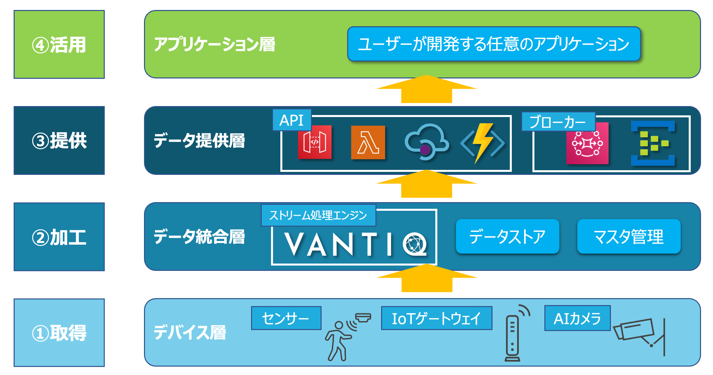

[English](../en/DETAILS.md)

# Smart Building Quick Start Details

## 目次

1. [はじめに](#introduction)
2. [デバイス層](#device-layer)

    2.1. [デバイスの仕様](#device-spec)

    2.1.1. [何ができるのか](#what-device-can-do)

    2.1.2. [品質](#device-quality)

    2.1.3. [データ送信方法](#device-data-transmission)

    2.1.4. [電源の供給方法](#device-power-supply)

    2.1.5. [設置要件](#device-installation)

    2.1.6. [データの仕様](#device-data-spec)

    2.2. [価格](#device-price)

    2.3. [法規制](#device-laws)

    2.4. [データの欠損](#device-data-loss)

    2.5. [データ統合層（Vantiq）へのデータ送信の経路](#device-data-path)

    2.6. [異常・故障時の運用](#device-operation)

    2.7. [デバイス層まとめ](#device-summary)

3. [データ統合層](#data-integration-layer)

    3.1. [マスタデータ管理](#data-integration-master-data)

    3.2. [データストア](#data-integration-data-store)

    3.3. [Vantiq](#data-integration-vantiq)

    3.3.1. [使用頻度の高いActivity pattern](#data-integration-activity)

    3.3.2. [パフォーマンスを考慮した実装](#data-integration-performance)

    3.3.2.1. [1タスクあたりの処理を軽くする](#data-integration-lighten)

    3.3.2.2. [クエリの発行回数を減らす・分散させる](#data-integration-reduce-queries)

    3.3.2.3. [同時実行回数を減らす](#data-integration-reduce-simultaneous)

    3.3.2.4. [実際にパフォーマンスが出るか確認する](#data-integration-performacne-test)

    3.4. [データ統合層まとめ](#data-integration-summary)

4. [データ提供層](#data-providing-layer)

    4.1. [PULL型（API）でのデータ提供](#data-providing-pull)

    4.2. [PUSH型（ブローカー）でのデータ提供](#data-providing-push)

    4.3. [データ提供層まとめ](#data-providing-summary)

<br />
<br />

<a id="introduction"></a>
## 1. はじめに

Vantiqを使用したスマートビル化を行う上で必要な知識、考え方、注意点の詳細についてまとめています。スマートビルにはデバイスからクラウドまで多岐にわたる要素があり、全体像を把握できている人は未だ多くありません。しかし、考える必要があるのは結局のところ、どのようにデータを集め、加工し、提供するかというシンプルな流れです。この流れをどうすれば実現できるのか？ということを意識しながら読んでいただければ幸いです。

この内容はあくまで基本形なので、要件ごとに必要に応じて変更が必要な箇所はありますが、基本の考え方は変わりません。

また、このドキュメントは以下の図の各層に沿って構成されています。



<a id="device-layer"></a>
## 2. デバイス層

デバイスはスマートビルだけでなく、全てのIoTプロジェクトの要となる最も重要な要素です。どのような企画であってもそれを実現するためのデータを取得できるデバイスが無ければ実現不可能です。また、デバイスの精度はそのままシステム全体のデータの精度になります。つまり、デバイス選定を間違えてしまうとプロジェクト自体の失敗に直結しますので慎重に決定する必要があります。
それではデバイスについての確認項目を見ていきたいと思います。


<a id="device-spec"></a>
### 2.1. デバイスの仕様

実現したい内容を達成することができるのか仕様を細かく確認する必要があります。デバイスが適していないものだった場合、そのままプロジェクトが失敗し時間もお金も無駄になるのでこのフェーズは時間をかけても慎重に行うべきです。

<a id="what-device-can-do"></a>
### 2.1.1. 何ができるのか

まずは当たり前の話ですが何ができるデバイスなのか、ということを正確に知る必要があります。
例えば「温度センサー」と一口に言っても、`①どのような範囲の温度を計測できるのか（検出範囲）`、`②どのような単位で計測ができるのか（分解能）`、`③どれくらいの誤差があり得るのか（精度）`を確認する必要があります。
例えば100℃を超えたらアラートを出すという機能を実現したい場合に検出範囲が-30〜+60℃の温度センサーを選定してしまったら当然実現できません。単なる「温度センサー」ではなく、まずは「-30〜+60℃までを0.1℃単位で±0.2℃程度の誤差があり得る温度センサー」くらいの解像度で何ができるデバイスなのか把握する必要があります。またAIカメラなど特定の区画を見続けるものの場合は1台あたりでカバーできる範囲を確認しておくことも重要です。


<a id="device-quality"></a>
### 2.1.2. 品質

デバイスの故障頻度が高かったり、耐火性・耐水性などが低かったりする場合思わぬメンテナンス費用や事故に繋がります。基本的な話ですが品質を確認しましょう。精度を実際に見てみるという意味でも実際に1台購入して検証してから採用を決定すると安心です。

<a id="device-data-transmission"></a>
### 2.1.3. データの送信方法

センシングした内容をどのように別の層に送信することができるのか確認します。例えば温度センサーを使いたいとして、センサー素子が付いたモジュールだけがあっても意味がありません。マイコンやIoTゲートウェイと合わせて使用することで初めてセンシングした内容を別の層に送信することができます。IoTゲートウェイと合わせて使用し、BLE接続などするものや、サービスとして一体となっていてクラウドにデータを直送できるものなどデバイスによって異なるため、確認しておく必要があります。IoTゲートウェイ以降の経路（WiFiなのかSIMを使ってLTE通信などなのか等）も合わせて確認します。

<a id="device-power-supply"></a>
### 2.1.4. 電源の供給方法

デバイスがバッテリー駆動なのかどうかは、設置する場所やメンテナンス性に大きく影響します。スマートビルディングの場合、バッテリー駆動のデバイスが候補になることは少ないと思いますが確認しておくと安全です。

<a id="device-installation"></a>
### 2.1.5. 設置要件

設置要件は２つあります。まずはデバイスの設置要件です。どのような環境にどのような状態で設置されたら、仕様として定義されている性能が出せるか、ということです。間違った設置を行うと仕様通りの性能は出ませんので、「何ができるデバイス」なのかがわかった後は「どのように使ったらその性能が出せるのか」を確認します。
例えば100%の精度で人の顔を検出できるAIカメラがあったとしても、カメラの映像が白飛びしてしまうような場所や暗い場所にこのAIカメラを設置したら全く人の顔を検出できないようなことがあり得ます。
２つ目はビル側から要求される設置要件です。ビル内のどこにでも好きなようにデバイスを設置できるケースはあまりないと思います。景観や故障交換時なども考慮してビル側が許可する設置場所に設置する必要があります。

「このデバイスを使えればやりたいことができる、ではこのデバイスはメンテナンスしやすい形でこのビルに設置できるのだろうか？」ということを確認する必要があります。


<a id="device-data-spec"></a>
### 2.1.6. データの仕様

プロトコル、フォーマット、サイズ、送信頻度を確認します。プロトコルやフォーマットによってどのように他の層にデータを連携できるか決まってきます。サイズや送信頻度は対向するシステムのパフォーマンスや、実装に大きく関係します。

<a id="device-price"></a>
### 2.2. 価格

デバイス、IoTゲートウェイ、WiFiルーター、SIMカードなど必要なものの価格と必要な数を計算し、コストが見合うか確認します。デバイスによっては専用のクラウドサービスを経由する場合もあり、そこまでを含めた料金体系であることがあります。

<a id="device-laws"></a>
### 2.3. 法規制

特に海外のデバイスを扱う場合に注意が必要です。技適マークやPSEマークを取得しているかなどのデバイスに対する法規制と、事業者に課される法規制（個人情報保護法など）をクリアしているか（できるか）を確認します。日本の法律に則したデバイスである必要があります。また個人情報などを含むデータの取り扱いには注意が必要です。

<a id="device-data-loss"></a>
### 2.4. データの欠損

特に無線接続の場合データの欠損が起こるので、デバイスの数を増やして欠損率を下げる、アプリ側で補完する、欠損が出ても影響のない設計にするなどの対策を考慮する必要があります。

<a id="device-data-path"></a>
### 2.5. データ統合層（Vantiq）へのデータ送信の経路

デバイスからデータ統合層のVantiqにどのようにデータを送るのか経路を考える必要があります。Vantiqにデータを届ける場合大きく分けて２つのパターンがあります。1つ目はVantiqのREST APIを使用する方法です。2つ目はMQTT、AMQP、Kafkaなどのプロトコルでブローカーを経由する方法です。

まずVantiqのREST APIを使う場合はVantiqから発行されるアクセストークンをヘッダーに設定した上でHTTPリクエストを行う必要があります。デバイス側にこの機能がある場合はこの方法を使うことができます。場合によってHTTPリクエストはできるもののヘッダーの設定ができない場合がありますがこの場合はAWS LambdaやAzure Functionsなどを中継するという手段もあります。（デバイスはLambda/Functionsにリクエストし、Lambda/FunctionsでVantiqのアクセストークンを保持して、VantiqにPOSTするというようなことです。）

REST APIを使う方法はシンプルですが以下のデメリットがあります。

1. アクセストークンの管理が煩雑になる
デバイスにアクセストークンを埋め込むことになるため、トークンの失効・流出などで更新が必要になった際、トークンをどう配布していたかによりますが場合によっては全デバイスのトークンを入れ替える作業が発生してしまいます。

2. Vantiqのパフォーマンスへの影響
HTTPはプロトコルとして軽量ではないため、デバイス数が多い場合はVantiqのリソースを多く消費することになります。


次にブローカーを経由する方法は、デバイスに対してアクセストークンを発行する必要がなくなります（ブローカーへの認証情報は必要です）。また、HTTPと比較して軽量なMQTT・AMQP、Kafkaのプロトコルを使用できます。
デメリットは以下の通りです。

1. ブローカーを用意する必要がある
例えばAWS AmazonMQやAzure Event Hubsを用意する必要があります。それぞれのブローカーのパフォーマンスや必要な設定などの特性を理解しておく必要があります。

2. プロトコル対応の難易度がHTTPより高い
Vantiq側は予めMQTT、AMQP、Kafkaのクライアントが用意されているため問題ありませんが、HTTPには対応していてもMQTT、AMQP、Kafkaに対応しているものは多くないと思います。

まとめるとデバイスが極端に少ない場合を除いてブローカー経由とした方が運用が楽になります。ブローカーを構築する必要がありますがフルマネージドのものを使えば良いですし、AWS IoT CoreやAzure IoT hubなどでデバイス管理をしておけば、デバイスからのデータを受信した際にブローカーにルーティングさせることができるため、プロトコルの対応に関しても容易です。

**デバイス管理サービスについて**
>よくデバイス管理を謳うサービスがありますがここでいうデバイスとはなんでしょうか。決して「センサー管理」とは言わないと思います。こう言ったサービスはインターネットに繋がっているデバイスを管理できるものなので正確にいうと「IoTゲートウェイ管理」になると思います。IoTゲートウェイは管理できてもそれに繋がっているセンサーまでは管理できません（もちろんセンシング部分とIoTゲートウェイの機能が一体化しているものは問題ないです）。いずれにせよ具体的に何ができるサービスなのか理解した上で導入を決定した方が良いと思います。

<a id="device-operation"></a>
### 2.6. 異常・故障時の運用

絶対に壊れない機械は存在しないのでどんなデバイスもいつかは必ず異常が起きたり、故障します。なんらかの異常が起きているデバイスを特定できたり、交換しても問題がないようにシステム設計や組織的な運用の立て付けを行なっておく必要があります。

<a id="device-summary"></a>
### 2.7. デバイス層まとめ

最も重要な層であるだけに確認する点は多いですがシンプルにまとめて仕舞えば、①企画を達成するためのデータが取得できること、②取得したデータをVantiqに送る経路を確立できること、③継続して運用ができる状態になっていることを確認できれば良いです。

<a id="data-integration-layer"></a>
## 3. データ統合層

データ統合層は、複数センサー同士のデータを組み合わせたり、センサーデータへのマスタデータ付与、閾値判定、整形など、データの統合処理を行い最終的にユーザーへ提供したいデータを作成する層です。

デバイス層からのデータを直接処理するのはVantiqが担当し、その処理に必要なマスタデータの管理はVantiqとは別のアプリケーションなどで行います。またVantiqはストリーム処理に特化している性質上、最新の一件など限られたデータは保持しますが、古いデータを保持しないため、処理後のデータを分析用などに保存しておきたい場合は別途データストアに保存します。

<a id="data-integration-master-data"></a>
### 3.1. マスターデータ管理

多くの場合、デバイスから送信されるデータをそのまま使用するわけではなく、人がわかりやすいようなデバイス名や、その設置場所・座標など、送信されてきたデータに加えて必要な内容をマスタデータとして組み合わせることで最終的にユーザーに提供したいデータが作成できます。
例えば「部屋の温度が35℃を超えたら通知する」というユースケースを実現したい場合、温度データに加えてそのセンサーがどの部屋に設置されているのか、という情報が必要になります。温度を測定するデバイスから送信されるデータに元から設置場所が含まれていれば特に何もする必要がないですが、最低限のシリアル番号と温度データのみ含まれているような場合もあります。

このような場合にマスタデータをVantiqで予め持っておき、デバイスから送信されたデータと組み合わせることでその後の処理に必要な情報を揃えることが出来ます。
スマートビルでは多種多様なデバイスが使われ、それぞれデータの中身が全く異なります。Vantiq側で必要な情報を全て揃えられるようにしておくことで様々なユースケースに対応できます。

そして必要になるのがこのマスタデータを管理する役割です。実際にマスタデータを使うのはVantiqなのでVantiqでマスタデータを直接管理することも技術的には可能ですが、責任分界点の観点から分けることが望ましいです。

VantiqはTypeでマスターデータを保持することになるので、この役割を担うアプリケーションは自身のDBでマスタデータを持ちつつ、VantiqのTypeのレコードをREST APIを使ってCRUD処理できる必要があります。

<a id="data-integration-data-store"></a>
### 3.2. データストア

Vantiqで処理したデータのうち、長期保存が必要なものを保存するためのデータストアです。
要件に合わせて以下のようなデータを保存し続けます。
- Vantiqで作成したユーザーに提供するデータ
- デバイスから送信された生データ
- ログデータ

保存するデータはシステムの運用開始から増え続けることになるので、コスト増えていきます。闇雲になんでも保存する、ということではなく必要なデータを必要な量、最低限保存するように構築・設定を行います。

データストアはVantiqからデータを受け取れる必要があります。通常のDBよりVantiqのパフォーマンスが高いことが多いため、Vantiqに直接APIなどを実行させてデータを受け取るのではなく、より疎結合にしておくという意味でもブローカーやキューを経由させる実装にすることが望ましいです。


<a id="data-integration-vantiq"></a>
### 3.3. Vantiq

データ統合層の中核となる部分です。使用頻度の高いActivity patternや実装時の注意点などを記載します。

<a id="data-integration-activity"></a>
### 3.3.1. 使用頻度の高いActivity pattern

Vantiqには様々なActivity patternが用意されておりますがその中でも特に使用頻度が高くほぼ必ず使うものを紹介します。

- 整形: Transformation
    - 不要なパラメータを削除、パラメータ名変更、データの単位を揃えるなど、データの整形を行う際に使用します。デバイスから送信されるデータはデバイスごとに異なった形式になっているので、このActivityでデバイスごとの差異を吸収したり、最終的にユーザーに提供したいフォーマットに変換したりする際に使用します。

- 静的データの追加: Enrich
    - Typeのレコードの内容をストリーム処理するデータに対して追加することができるため、デバイスから送信されたデータに対してマスタデータを追加する際に使用することが多いです。処理するデータとTypeに同名のパラメータが存在する必要があるため、整形と合わせてProcedureで済ませる場合も多いです。

- フィルタリング: Filter
    - 設定した条件に合致したデータのみ通過させ次の処理に渡す機能です。閾値判定や、条件分岐に使用します。

- データ保存: SaveToType
    - Typeにデータを保存する際に使用します。Upsertオプションがあり、デバイスごとに最新の一件だけVantiqで保持したい際などに使用します。

- 自作Procedureの実行: Procedure
    - 自作したProcedureを呼び出すことができるため最も汎用性の高いActivityです。あらゆる箇所で使われますが多いケースはVantiqから他のシステムにデータを送信する処理を自作するケースです。他のシステムに送信したい場合「PublishToSource」を使うこともできますが、エラーのハンドリングなど細かい設定ができないため、Procedureを使うことが多いです。


<a id="data-integration-performance"></a>
### 3.3.2. パフォーマンスを考慮した実装

Vantiqは高パフォーマンスが発揮できるプラットフォームではありますが、実装の仕方によってはパフォーマンスを出すことができません。Vantiqの特性の理解とそれに合わせた実装が必要になります。特にストリーム処理を用いない通常のWebアプリケーションの実装に慣れている方ほど注意が必要です。VantiqはWeb（またはモバイル)クライアント、DB、アプリケーションというような要素は揃っているので従来のWebアプリケーションの３層アーキテクチャのような実装はできてしまいます。
しかしあくまでストリーム処理に特化したサービスですのでWebアプリ開発の常識をそのまま持ち込むと失敗します。
非同期かつ並列に小さい処理を高速で捌くようなイメージを持つことが必要です。

<a id="data-integration-lighten"></a>
### 3.3.2.1. １タスクあたりの処理を軽くする

Vantiqアプリケーションを実装する際は1タスクあたりで処理する内容を軽くしていく必要があります。Procedureを使う場合いくらでも処理をまとめて1つのタスクで呼び出すことができますが、Vantiqは1タスクの単位で負荷分散をしていきますので1タスクで重い処理を実行するよりも複数タスクに分割させた方がパフォーマンスは向上します。代表的な重い処理とはSQLの発行などメモリだけで処理が完結しないものや、外部のAPIなどを実行するようなVantiq以外のシステムの応答を待つ必要がある処理が上げられます。

<a id="data-integration-reduce-queries"></a>
### 3.3.2.2. クエリの発行回数を減らす・分散させる

Typeに保存されているマスタデータを参照したり、何かしらデータを書き込んだりする際はクエリを発行することになります。この処理はメモリだけで完結する処理と比較して重い処理になります。従ってパフォーマンスを出したい場合はこの回数を減らし、分散させることが重要です。

例えば要件によっては1つのデバイスからの送信データに対して複数種類のマスタデータを追加していく必要がある場合があります。その場合以下のようにProcedureで実装することができます。

```
PROCEDURE attachMasterData(event)
event.master1 = SELECT ONE FROM master1 WHERE device_id == event.deviceId
event.master2 = SELECT ONE FROM master2 WHERE device_id == event.deviceId
event.master3 = SELECT ONE FROM master3 WHERE device_id == event.deviceId
return event
```

1つのProcedureで３回クエリを発行しています。このProcedureをアプリケーションのタスクで呼び出す場合１タスクで3回クエリを発行することになります。メンテナンスや改修時には楽ですが、これだとパフォーマンスが出ません。（逆に言えばそこまでパフォーマンスを重視しない場合はこちらが望ましいでしょう）対応方法は以下の2つです。

1. 3つのProcedure、3つのタスクに分割する

    こちらはシンプルです。まとめているからパフォーマンスが出ない、ということであれば分割すれば良いです。これだけでもかなりパフォーマンスは改善します。ただしクエリの発行回数自体は減らせていません。

1. 非正規化したマスタデータ用Typeを用意しておく

    1回のクエリ発行で済ませるために必要なマスタデータをまとめるTypeを予め作っておく方法です。
    必要なデータを予め一つのTypeが保持していれば、そのTypeに対する1回のSELECT文で済ませることができます。

    ただし、どこまで柔軟にマスタデータの更新ができるかは、マスタデータ管理アプリケーションとの兼ね合いもありますし、非正規化することでマスターデータ管理が複雑になりますので、必要なパフォーマンス、メンテナンス性をよく考慮しバランスをとって検討してください。

    マスターデータ管理アプリケーション側が、非正規化されている場合でも問題なくデータの管理・同期ができる場合は問題ありませんが、正規化された状態でないと難しいケースもあります。

    その場合は、正規化されたTypeとそれらをまとめた非正規化されたTypeの両方をVantiq側で用意し、正規化されたTypeが更新されたことをトリガーに起動するVantiqアプリやRuleを作っておいて非正規化Typeを更新するという手段もあります。

    この方法はかなりパフォーマンスを追求する際に必要となる考え方です。導入には慎重な検討が必要です。


<a id="data-integration-reduce-simultaneous"></a>
### 3.3.2.3. 同時実行回数を減らす

大量のデータを0.1秒もズレがない状態で一斉に処理しようとすると一度にリソースを消費することになります。そのため、可能な限りタイミングをズラして処理をしていく必要があります。VantiqにもScheduled Eventがありますが、これを使って全く同じタイミングで大量のクエリを発行したりしてしまうと、クラスタ全体に負荷がかかる状態になります。

<a id="data-integration-performacne-test"></a>
### 3.3.2.4. 実際にパフォーマンスが出るか確認する

実際に本番運用時にかかる負荷をかけて十分なパフォーマンスが出せることを確認する必要があります。実際に本物のセンサーやIoTゲートウェイを使ってパフォーマンステストを行うことは非現実的なので、パフォーマンステストツールを使い検証します。

<a id="data-integration-summary"></a>
### 3.4. データ統合層まとめ

データ統合層を実装するには核となるVantiqの理解が必要になります。Webアプリケーションの実装とは異なる考え方をする必要があり、求められるパフォーマンスによってはある程度メンテナンス性を犠牲にする場合もあります。
ただし難しく考える必要はなく繰返しですが以下の観点を抑えて設計・実装すれば大丈夫です。
- 一つ一つの処理単位を小さくする
- Type(DB)の使用頻度を最小限にする
- 全く同じタイミンングで一気に負荷をかけない


<a id="data-providing-layer"></a>
## 4. データ提供層

ユーザーにデータ提供を行う層です。この層があることで下層についてユーザーは意識する必要がなくなります。データの提供方法は大きく分類するとPULL型とPUSH型の2種類の方法になります。データの特性によって提供方法を検討します。

提供したいデータが最新の一件のみで良いような場合は特に追加で何も用意しなくても、技術的にはユーザーにVantiqのREST APIのエンドポイントとアクセストークンを提供すればデータを取得させることができます。

しかし、ユーザーにVantiqのアクセストークンを配布するのは、管理不能になるため好ましくありませんし、ドメインに関してもVantiqのドメインであることがユーザーにとって好ましいものであるとも限りません。また、スマートビル全体で考えた時にVantiq以外からもデータ提供を行う可能性もあります。こういった理由から、データ統合層までの要素をこの層で隠蔽します。

ユーザーはデバイスからデータ統合層までを意識することなく、そこにどんな要素があったとしても、共通化されたインターフェースのAPIやブローカーを使うことができます。


<a id="data-providing-pull"></a>
### 4.1. PULL型（API）でのデータ提供

提供したいデータがセンシング結果の最新1件のみなど限られている場合はVantiqのTypeに提供したいデータを保持しておき、REST API経由でデータを提供するという方法を取ることもあります。ただし、ユーザーに直接VantiqのREST APIを実行させるわけではなく、AWS API Gateway/LambdaやAzure API Management/Functionsを経由でデータを提供します。

古いデータも提供できるようにする場合はVantiqで処理したデータをブローカー経由で別のデータストアに保存しておきます。

ユーザーはAWS API GatewayまたはAzure API Managementから提供されるAPIを実行し、それぞれとの実体となるLambda、FunctionsがVantiqやデータストアのREST APIを実行することでデータを取得することができます。


<a id="data-providing-push"></a>
### 4.2. PUSH型（ブローカー）でのデータ提供

提供したいデータの中で侵入検知等何らかのアラートなどリアルタイム性が求められるデータはこちらの提供方法が適しています。

Vantiqで閾値や条件一致の判定を行い、合致したデータをブローカーにPublishします。フルマネージドサービスを使用する場合はAWS AmazonMQやAzure Event Hubsが選択肢になります。これらのブローカーは簡単に構築できますが、例えばEvent Hubsは設定によって同時接続数が決まるなど注意が必要な点もあります。フルマネージドサービスを使う際はブローカーに限らずではありますが、サービス自体の特徴を理解した上で導入する必要があります。

<a id="data-providing-summary"></a>
### 4.3. データ提供層まとめ

この層に関しては実装自体は複雑ではありませんが、要件の内容によって求められるパフォーマンスや、APIを公開する範囲などが異なると思いますのでそれぞれのクラウドサービスの特徴を適切に理解し、必要な設定を行う必要があります。
