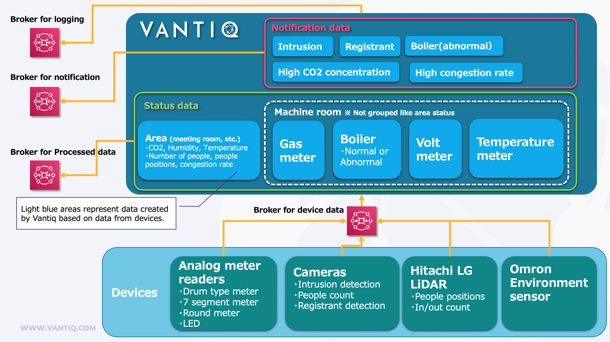

[Japanese](./README.md)

# Smart Building Quick Start Kit Vantiq Application  

This is the Vantiq application that can be used with the device samples. Data store or API Gateway are not included.

To use this, import the full set of [smart-building-quick-start-kit](./smart-building-quick-start-kit) in Vantiq IDE.  

- Sources are inactive, please set your MQTT Brokers and then make them active.  

- This application is designed performance-conscious, Types that are used for saving master data of each device are denormalized. Synchronization of master data is the responsibility of the master data administrator. 

- Limitation of frequency of data transmission from Vantiq is not implemented. please note that depends on the frequency of data from devices.
