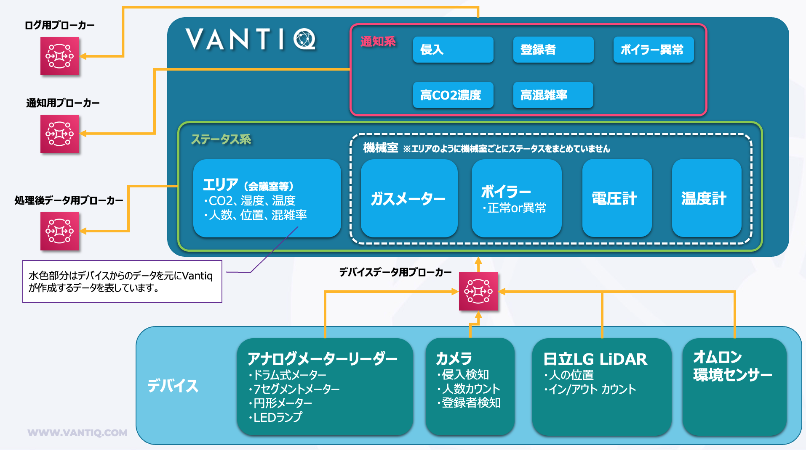

[Japanese](./README.md)

# Smart Building Quick Start Kit Vantiq Application  

This is the Vantiq application that can be used with the device samples. Data store and API Gateway are not included.

To use this, import the full set of [smart-building-quick-start-kit](./smart-building-quick-start-kit) in the Vantiq IDE.  

- Source is set to inactive, so please configure your MQTT Broker and then make it active.  

- Because of the performance conscious design, Types which are used for saving the master data of each device is denormalized. Synchronization of master data is the responsibility of the master data administrator.   

- There is no limit on the frequency of transmission from Vantiq to an MQTT broker. Please note that it depends on how often the data is sent from the device.   
