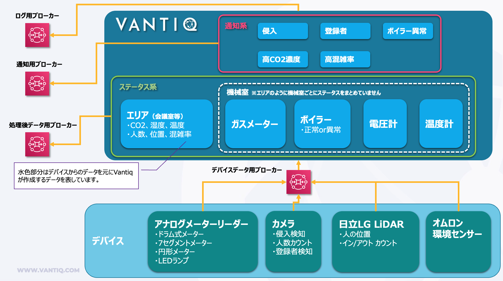

[English](./README.en.md)

# Smart Building Quick Start Kit Vantiq Application

デバイスのサンプルと合わせてご利用いただけるVantiqアプリケーションです。

使用する場合は、[smart-building-quick-start-kit](./smart-building-quick-start-kit) の配下一式をVantiq IDEにてインポートしてください。

- Sourceはinactiveになっておりますのでご自身のMQTTブローカーを設定の上、activeにしてください。

- パフォーマンスを考慮した設計になっているため、各デバイスのマスターデータの保存に使用するTypeは非正規化されています。マスターデータの同期はマスターデータの管理者の分担となります。

- VantiqからMQTTブローカーへの送信頻度の制限はかけておりません。デバイスからデータが送信される頻度次第となりますのでご注意ください。

